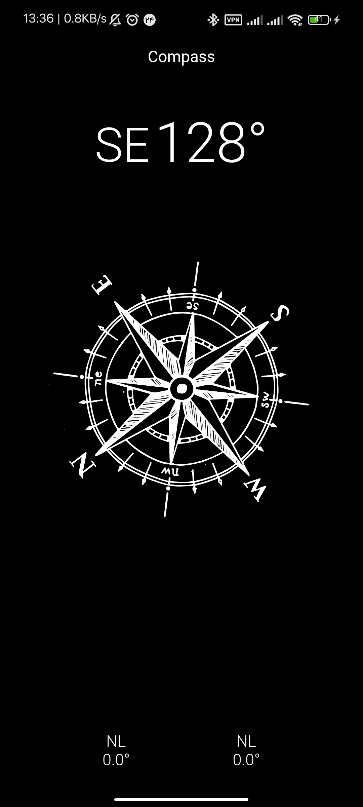

# Compass app

# 3rd Packages
    - dio:  Http Client
    - get : for State Managment 
    - flutter_launcher_icons:  App's icon managment

# Features
    - Compass: for orientation

# Environments
    I used Android Studio
    Flutter 3.13.3 • channel stable 
    Dart 3.1.1

# How to run

    First, Android Studio -> AVD Manager -> run select device

    Second, VS Code termial: flutter run -d 'device_name'

# Images

    <table>
        <tr>
            <td style="text-align: center">
                    
            </td>
        </tr>
    </table>

